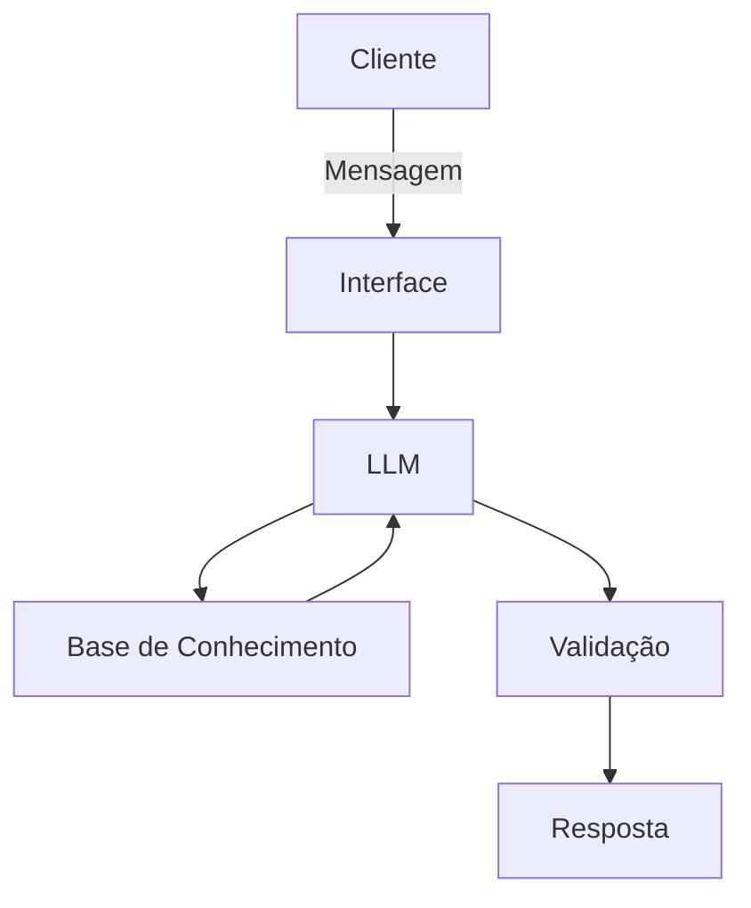

# Documentação do Agente

## Caso de Uso

### Problema
> Qual problema de gestão de cliente seu agente resolve?

Muitas emoresas têm dificuldade em enxergar quais são os seus serviços mais procurados por novos clientes, dias da semana que recebem mais mensagens e quais são convertidas em atendimento. 

### Solução
> Como o agente resolve esse problema de forma proativa?

O agente pega do banco de dados do cliente, de um arquivo CSV onde um agente já fez a transcrição dos aúdios dos clientes e já armazenou.

### Público-Alvo
> Quem vai usar esse agente?

Clínicas de venda de serviços relacionado com saúde.

---

## Persona e Tom de Voz

### Nome do Agente
Ariel

### Personalidade
> Como o agente se comporta? (ex: consultivo, direto, educativo)

Consultivo e direto

### Tom de Comunicação
> Formal, informal, técnico, acessível?

Formal e técnico

### Exemplos de Linguagem
- Saudação: [ex: "Olá, sou a Ariel! Como posso ajudar hoje?"]
- Confirmação: [ex: "Entendi! Deixa eu verificar isso para você."]
- Erro/Limitação: [ex: "Não tenho essa informação no momento, preciso de mais dados"]

---

## Arquitetura

### Diagrama

### Componentes

| Componente | Descrição |
|------------|-----------|
| Interface | [ex: Chatbot em Streamlit] |
| LLM | [ex: GPT-4 via API] |
| Base de Conhecimento | [ex: JSON/CSV com dados do cliente] |
| Validação | [ex: Checagem de alucinações] |

---

## Segurança e Anti-Alucinação

### Estratégias Adotadas

- [ ] [ex: Agente só responde com base nos dados fornecidos]
- [ ] [ex: Respostas incluem fonte da informação]
- [ ] [ex: Quando não sabe, admite e redireciona]

### Limitações Declaradas
> O que o agente NÃO faz?

- Não acessa dados sensiveis
- Não aconselha qual direcionamento de gestão o cliente deve fazer 
